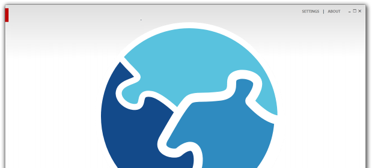

# GitHub Pages Template

### Make your github project page stylish

This is a simple Jekyll template that the Code52 team have used to style our project pages. It is intended to be a landing page to a GitHub repository and include basic information and links for further information.

### Examples

 - [MarkPad](http://code52.org/DownmarkerWPF/)
 - [ASP.NET Internationalization](http://code52.org/aspnet-internationalization/)
 
## Installation

To integrate these changes into an existing repository, follow these instructions:

**NOTE:** will test these methods out. Use at your own risk for now.

### Check if you have a gh-pages branch

To confirm if you have an existing gh-pages branch, run the following commands in your fork:

    git fetch origin
    git branch -a

This will display the branches in your fork and the remote repository:

	D:\Code\github\shiftkey\gh-pages-template [master]> git branch -a
	* master
	  remotes/origin/gh-pages
	  remotes/origin/master

### Create the gh-pages branch

    cd {path to your repository}
    git checkout --orphan gh-pages 
    git remote add gh-pages-templates git://github.com/shiftkey/gh-pages-template.git
    git fetch gh-pages-templates
    git pull gh-pages-templates gh-pages
    git push origin gh-pages

### Add the template to an existing branch

    cd {path to your repository}
    git checkout gh-pages
    rm . -rf
    git add -u
    git commit -m "removed old version"
    git remote add gh-pages-templates git://github.com/shiftkey/gh-pages-template.git
    git fetch gh-pages-templates
    git pull gh-pages-templates gh-pages
    git push origin gh-pages

## Customisation

Once you have those changes in place, start editing the values to get your site up running:

**_config.yml**

	appname: Your Project
	appslogan: 'catchphrase goes here'
	username: your-account
	reponame: your-repo
	accent: FF3333
	darkaccent: 134A8A
	description: 'Suspendisse vel elit a arcu pretium egestas non nec sapien. Curabitur augue dui, porttitor vitae aliquet sit amet, tempor vitae nisi. Curabitur accumsan sodales nunc ac pulvinar.'

	feature1title: 'feature one'
	feature2title: 'feature two'
	feature3title: 'feature three'

	feature1desc: 'Lorem ipsum dolor sit amet, consectetur adipiscing elit. Sed pellentesque vehicula mauris, ut molestie magna rutrum vitae.'
	feature2desc: 'Vestibulum vulputate mollis metus, at laoreet purus pharetra quis. Vivamus ut sem sit amet nisl pulvinar aliquet.'
	feature3desc: 'Vivamus eu enim eget turpis porttitor dictum. Integer id sapien a mauris cursus bibendum.'

**_layouts/default.html**

This is the theme for the project site. It links to a pair of CSS files.

	<!DOCTYPE html>
	<html>
		<head>
			<meta charset='utf-8'>
			<meta content="text/html; charset=utf-8" http-equiv="Content-Type" />
			<meta name="viewport" content="width=device-width, initial-scale=1, maximum-scale=1" />
			<title>{{ site.appname }}</title>
			<link rel="shortcut icon" href="icon.png" />
			
		</head>
		<body>
			

				{{content}}
			

			
&nbsp;

		</body>
	</html>

**_layouts/index.html**

This is the content for the root of the site - introducing the project and using the content from the `_config.yml` file.

	---
	layout: default
	---

	
<a href="http://www.code52.org">a code 52 project</a>

	<h1>{{ site.appname }}&nbsp;-&nbsp;{{site.appslogan}}</h1>
	

		
		
	

	

		

			<h2>{{ site.feature1title}}</h2>
			{{ site.feature1desc }}
		

		

			<h2>{{ site.feature2title}}</h2>
			{{ site.feature2desc }}
		

		

			<h2>{{ site.feature3title}}</h2>
			{{ site.feature3desc }}
		

		
&nbsp;

	

	
	

		<a href="getting-started.html">Getting started</a>  
		<a href="http://github.com/{{ site.username }}/{{ site.reponame }}/downloads">Download for Windows</a>  
		<a href="http://github.com/{{ site.username }}/{{ site.reponame }}">Get the source</a>
	

	{{content}}
	

